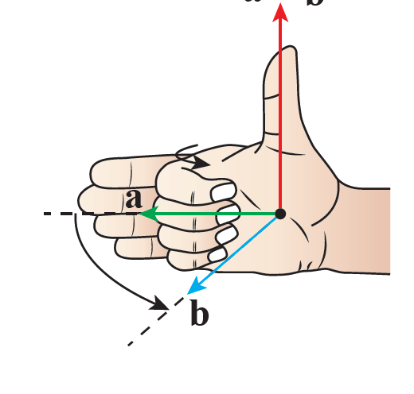
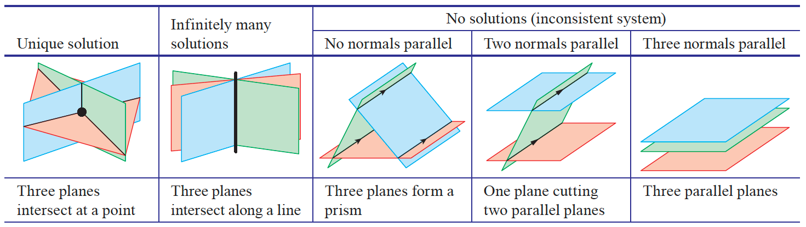

# Chapter 8: Vectors - Contents

## Overview and Purpose

This chapter introduces vectors as mathematical objects for modelling **position, displacement, direction, and magnitude**, and develops vector methods for solving **three-dimensional geometrical problems**. The emphasis is on linking **algebraic, geometric, and vector representations** and using vectors as a unifying language for spatial reasoning.

## 8A. Introduction to Vectors

### 8A.1 Vector Concepts and Representation

* Definition of a vector as a quantity with **magnitude and direction**
* Distinction between **scalar** and **vector** quantities
* Diagrammatic representation using directed line segments
* Notation conventions:
  * Bold or underlined letters
  * Arrow notation
* Equality of vectors independent of position

### 8A.2 Component Form and Base Vectors

* Representation of vectors using **components**
  * Column vector notation in 2D and 3D
* Introduction to **unit base vectors**:
  * $\mathbf{i}$, $\mathbf{j}$, $\mathbf{k}$
* Conversion between:
  * component form $\longleftrightarrow$ basis-vector form
* Interpretation of missing or zero components

### 8A.3 Vector Operations

* **Addition of vectors**
  * Head-to-tail method
  * Parallelogram rule
  * Component-wise addition
* **Subtraction of vectors**
  * Addition of the negative vector
* Vectors defined by endpoints (e.g. $\vec{AB}$)

### 8A.4 Scalar Multiplication and Parallel Vectors

* Effect of scalar multiplication on magnitude and direction
* Negative scalars and direction reversal
* Condition for vectors to be **parallel**
  * One vector as a scalar multiple of another
* Solving component equations to determine unknown scalars

### 8A.5 Magnitude and Unit Vectors

* Calculation of vector magnitude using Pythagoras’ theorem
* Interpretation of magnitude as length
* Construction of **unit vectors** in arbitrary directions
* Direction ambiguity (positive vs negative unit vectors)

## 8B. Vectors and Geometry

### 8B.1 Position and Displacement Vectors

* Definition of a **position vector** relative to the origin
* Coordinates as components of position vectors
* **Displacement vectors** between two points
  * Difference of position vectors
* Geometric interpretation of displacement

### 8B.2 Distances Between Points

* Distance as the magnitude of a displacement vector
* Exact distances in 3D space
* Relationship between vectors $\vec{AB}$ and $\vec{BA}$

### 8B.3 Using Vectors to Prove Geometric Properties

* Vector conditions for:
  * Parallelograms
  * Rhombuses
* Equality and parallelism of opposite sides
* Use of vector magnitudes to test side lengths

### 8B.4 Collinearity and Ratios

* Condition for points to be **collinear**
  * One displacement vector is a scalar multiple of another
* Solving for unknown coordinates using vector equations
* Division of line segments in given ratios
* Internal and external division

### 8B.5 Midpoints and Centroids

* Vector formula for the midpoint of a line segment
* Proof of midpoint formula using vectors
* Application to triangles and quadrilaterals
* Vector-based proofs of classical geometry results
  * Medians
  * Parallelogram midpoint properties

### 8B.6 Advanced Geometric Proofs

* Expressing unknown points symbolically
* Showing concurrency and collinearity
* Using vector ratios to prove lines intersect at specific points
* Emphasis on algebraic reasoning over coordinate substitution

## 8C. Scalar Product and Angles

### 8C.1 Definition of the Scalar (Dot) Product

* Scalar product as a measure of alignment between vectors
* Formula:

$$
\mathbf{a} \cdot \mathbf{b} = |\mathbf{a}| \cdot |\mathbf{b}| \cos\theta
$$

* Interpretation via projection
* Applications in physics (e.g. work done)

### 8C.2 Scalar Product in Component Form

* Algebraic formula for dot product using components
* Possibility of negative scalar products
* Relationship between algebraic and geometric definitions

### 8C.3 Angles Between Vectors

* Derivation of angle formula using dot product
* Finding angles between:
  * Two vectors
  * Lines in space
* Application to problems involving:
  * Points and triangles in 3D
  * Dihedral and internal angles

## 8D. Equations of Lines in Three Dimensions

### 8D.1 Vector Equation of a Line

* A line in 3D is defined by:
  * A **point** on the line
  * A **direction vector**

Vector equation of a line:

$$
\mathbf{r} = \mathbf{a} + \lambda \mathbf{d}
$$

where:

* $\mathbf{a}$ is the position vector of a point on the line
* $\mathbf{d}$ is a direction vector
* $\lambda \in \mathbb{R}$ is a parameter

Interpretation:

  * As $\lambda$ varies, $\mathbf{r}$ traces out the line
  * Same line can be written using different $\mathbf{a}$ or $\mathbf{d}$

### 8D.2 Lines Through Two Points

* Direction vector between points $A$ and $B$:

$$
\mathbf{d} = \vec{AB} = \mathbf{b} - \mathbf{a}
$$

* Line through $A$ and $B$:

$$
\mathbf{r} = \mathbf{a} + \lambda(\mathbf{b} - \mathbf{a})
$$

* Emphasises the geometric meaning of displacement vectors

### 8D.3 Parametric and Cartesian Forms

* From vector form:

$$
\mathbf{r} =
\begin{pmatrix}
x \ y \ z
\end{pmatrix}
=
\begin{pmatrix}
x_0 \ y_0 \ z_0
\end{pmatrix}
+
\lambda
\begin{pmatrix}
l \ m \ n
\end{pmatrix}
$$

* Parametric equations:

$$
x = x_0 + \lambda l,\quad
y = y_0 + \lambda m,\quad
z = z_0 + \lambda n
$$

* Cartesian (symmetric) form:

$$
\frac{x - x_0}{l} = \frac{y - y_0}{m} = \frac{z - z_0}{n}
$$

### 8D.4 Intersections, Parallel and Skew Lines

* **Intersecting lines**:
  * Share a common solution for $\lambda$ and $\mu$
* **Parallel lines**:
  * Direction vectors are scalar multiples
* **Skew lines**:
  * Do not intersect and are not parallel
  * Occur only in three dimensions
* Use of simultaneous equations to classify relationships

### 8D.5 Applications to Kinematics

* Constant velocity motion model:

$$
\mathbf{r} = \mathbf{r}_0 + t\mathbf{v}
$$

* Interpretation:

  * $\mathbf{r}_0$ = initial position
  * $\mathbf{v}$ = velocity vector
  * $t$ = time

* Speed is the magnitude $|\mathbf{v}|$

* Strong link between geometry and physical motion

## 8E. Distances and Angles in Three Dimensions

### 8E.1 Angle Between Two Lines

* Angle between two lines is the angle between their **direction vectors**

* Using the scalar product:

$$
\cos\theta = \frac{\mathbf{d}_1 \cdot \mathbf{d}_2}{|\mathbf{d}_1||\mathbf{d}_2|}
$$

* Applicable to:

  * Skew lines
  * Intersecting lines
  * Parallel lines (angle $0^\circ$ or $180^\circ$)

### 8E.2 Distance from a Point to a Line

* Shortest distance is **perpendicular distance**
* Method:
  * Express displacement from point to any point on the line
  * Use projection or trigonometry
* Often uses:
  * Scalar product to identify perpendicularity
  * Magnitude of vector components

### 8E.3 Distance Between Two Skew Lines

* Shortest distance lies along a line perpendicular to **both direction vectors**
* Use of:
  * Vector product to find perpendicular direction
  * Projection onto this direction
* Important for spatial reasoning and modelling

## 8F. Vector Product and Areas

### 8F.1 Definition of the Vector (Cross) Product

* The vector product of $\mathbf{a}$ and $\mathbf{b}$ is written:

$$
\mathbf{a} \times \mathbf{b}
$$

Properties:

* Magnitude:

$$
|\mathbf{a} \times \mathbf{b}| = |\mathbf{a}||\mathbf{b}|\sin\theta
$$

  * Direction:
    * Perpendicular to both $\mathbf{a}$ and $\mathbf{b}$
    * Given by the **right-hand rule**
* Result is a **vector**, not a scalar

### 8F.2 Component Form of the Vector Product

* For vectors:

$$
\mathbf{a} =
\begin{pmatrix}
a_1 \ a_2 \ a_3
\end{pmatrix},
\quad
\mathbf{b} =
\begin{pmatrix}
b_1 \ b_2 \ b_3
\end{pmatrix}
$$

* Cross product:

$$
\mathbf{a} \times \mathbf{b} =
\begin{pmatrix}
a_2b_3 - a_3b_2 \
a_3b_1 - a_1b_3 \
a_1b_2 - a_2b_1
\end{pmatrix}
$$

* Order matters: $\mathbf{a} \times \mathbf{b} = -(\mathbf{b} \times \mathbf{a})$

### 8F.3 Algebraic Properties

* Key identities:
  * $\mathbf{a} \times \mathbf{a} = \mathbf{0}$
  * Parallel vectors $\Rightarrow \mathbf{a} \times \mathbf{b} = \mathbf{0}$
  * Perpendicular vectors $\Rightarrow |\mathbf{a} \times \mathbf{b}| = |\mathbf{a}||\mathbf{b}|$
* Distributive over addition

### 8F.4 Areas of Parallelograms and Triangles

* Area of parallelogram formed by $\mathbf{a}$ and $\mathbf{b}$:

$$
\text{Area} = |\mathbf{a} \times \mathbf{b}|
$$

* Area of triangle:

$$
\text{Area} = \frac{1}{2}|\mathbf{a} \times \mathbf{b}|
$$

* Widely used for:

  * Coordinate geometry
  * 3D triangle and polygon problems

Below are **Sections 8G and 8H**, extracted and written to **match the same structure, tone, and level of detail** as the attached Chapter 8 markdown overview you shared. The content is aligned with the later parts of *Chapter 8: Vectors* and follows the established pattern used for 8D–8F.

## 8G. Equations of Planes

### 8G.1 Vector Equation of a Plane

* A plane in three-dimensional space is defined by:
  * A **point** on the plane
  * Two **non-parallel direction vectors** lying in the plane
* Vector equation of a plane:

$$
\mathbf{r} = \mathbf{a} + \lambda \mathbf{u} + \mu \mathbf{v}
$$

where:

* $\mathbf{a}$ is the position vector of a point on the plane
* $\mathbf{u}$ and $\mathbf{v}$ are non-parallel direction vectors in the plane
* $\lambda, \mu \in \mathbb{R}$

Interpretation:

* Varying $\lambda$ and $\mu$ generates all points in the plane
* Different choices of $\mathbf{a}, \mathbf{u}, \mathbf{v}$ can describe the same plane

### 8G.2 Normal Vector and Cartesian Equation of a Plane

* A **normal vector** $\mathbf{n}$ is perpendicular to the plane
* If $\mathbf{r}$ is any point on the plane and $\mathbf{a}$ is a fixed point on the plane, then:

$$
(\mathbf{r} - \mathbf{a}) \cdot \mathbf{n} = 0
$$

* This leads to the **Cartesian equation of a plane**:

$$
Ax + By + Cz = D
$$

where:

* $(A, B, C)$ are the components of the normal vector
* $D = \mathbf{a} \cdot \mathbf{n}$

Key ideas:

* The normal vector uniquely defines the plane’s orientation
* Cartesian form is especially useful for:

  * Testing whether a point lies in a plane
  * Finding intersections with lines

### 8G.3 Planes Through Points and Lines

* A plane can be defined by:
  * Three **non-collinear points**, or
  * A **line** and a **point not on the line**
* Typical approach:
  * Form two independent direction vectors
  * Use their vector product to find a normal vector
* Emphasises construction of planes from geometric data

## 8H. Intersections and Angles Between Lines and Planes

### 8H.1 Angle Between a Line and a Plane

* The angle between a line and a plane is defined as the **complement** of the angle between:
  * The line’s direction vector
  * The plane’s normal vector
* If $\mathbf{d}$ is the line’s direction vector and $\mathbf{n}$ is the plane’s normal vector:

$$
\sin\theta = \frac{|\mathbf{d} \cdot \mathbf{n}|}{|\mathbf{d}||\mathbf{n}|}
$$

Key interpretation:

* $\theta = 0^\circ$: line lies in the plane
* $\theta = 90^\circ$: line is perpendicular to the plane

### 8H.2 Angle Between Two Planes

* The angle between two planes is the angle between their **normal vectors**
* If $\mathbf{n}_1$ and $\mathbf{n}_2$ are the normal vectors:

$$
\cos\theta = \frac{\mathbf{n}_1 \cdot \mathbf{n}_2}{|\mathbf{n}_1||\mathbf{n}_2|}
$$

Special cases:

* Parallel planes → normals are parallel
* Perpendicular planes → normals are perpendicular

### 8H.3 Intersections of Lines and Planes

* A line intersects a plane if there is a common solution to:
  * The vector equation of the line
  * The equation of the plane
* Method:
  * Substitute the parametric form of the line into the plane equation
  * Solve for the parameter
* Possible outcomes:
  * One solution → line intersects plane at a single point
  * No solution → line is parallel to plane
  * Infinitely many solutions → line lies in the plane

### 8H.4 Distance from a Point to a Plane

* The shortest distance from a point to a plane is measured **along the normal direction**
* Uses:
  * The plane’s Cartesian equation
  * Magnitude of the normal vector
* Reinforces the geometric meaning of dot products and projections

